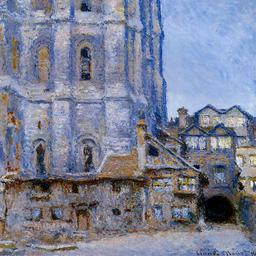
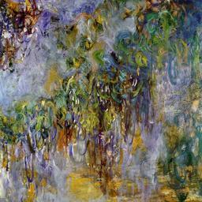
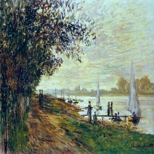
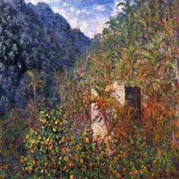
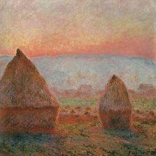
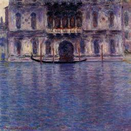

# Monet_Style_Cyclic_GAN (Kaggle Competition)
A GAN consists of at least two neural networks: a generator model and a discriminator model. The generator is a neural network that creates the images. For our competition, you should generate images in the style of Monet. This generator is trained using a discriminator.  The two models will work against each other, with the generator trying to trick the discriminator, and the discriminator trying to accurately classify the real vs. generated images.The task is to build a GAN that generates 7,000 to 10,000 Monet-style images.

